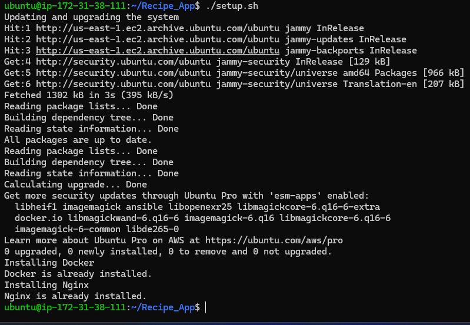

# CI/CD Deployment using GitHub Runner

This project demonstrates a full CI/CD pipeline using **GitHub Runner** to deploy a **Recipe App** to an **AWS EC2 Instance** using Docker.

---

## Overview

This project includes:

- **Server Setup Script** to configure Docker and NGINX on AWS EC2.
- **CI/CD Pipeline**:
  - Install project dependencies.
  - Build Docker images.
  - Push backend to a **public DockerHub repository**.
  - Push frontend to a **private DockerHub repository**.
  - Pull and deploy the latest images on an AWS EC2 instance.

---

## Prerequisites

- AWS account with an EC2 Ubuntu instance.
- Github repo with Secrets added.
- DockerHub account.
- SSH access to the EC2 instance.

---

## Steps Performed

### 1. Server Setup Script (Bash)

- Installed Docker (if not already installed).
- Installed and configured NGINX (skips if already installed).
- Restart NGINX to apply changes

### 2. Continuous Integration (CI)

- Installed project dependencies via `npm install` (for both React and Express).
- Built Docker images for:
  - **Frontend (React)**
  - **Backend (Express)**
- Pushed Docker images to **DockerHub repositories**.

### 3. Continuous Deployment (CD)

- On the **AWS EC2 Instance**:
  - Pulled the latest Docker images from DockerHub.
  - Deployed the application to EC2 Instance.

---

## How to Run

### Step 1: Launch & Configure your AWS EC2 Instance

- Launch a **Ubuntu EC2 instance** with:
  - Security Group allowing ports **22 (SSH)**, **80 (HTTP)**,**443 (HTTPS)**,**3000 (Frontend)** and **5000 (backend)**.

### Step 2: Run Server Setup Script on EC2

SSH into your EC2 instance and run:

```
git clone https://github.com/janakniraula/Recipe_App.git
```
```
cd Recipe_App
```
```
bash setup.sh
```
### Step 3: Setup CI/CD Pipeline

1. Add AWS and DockerHub credentials as **GitHub Secrets**:
   - `DOCKER_USERNAME`
   - `DOCKER_PASSWORD`
   - `AWS_EC2_IP `
   - `AWS_EC2_USERNAME `
   - `AWS_EC2_SSH_KEY `

2. Commit and push changes to the `main` branch. The GitHub Action will automatically:
   - Build and push Docker images.
   - pull the docker images.
   - Deploy the latest version on your **EC2 instance**.

---

### CI/CD Pipeline Workflow

- **Trigger:** Push to `main` branch
- **CI:**
  - Installs dependencies.
  - Builds Docker images (**React** and **React**).
  - Pushes images to **DockerHub**.
- **CD:**
  - EC2 Runner pulls Docker images.
  - Deploys containers via **Docker Compose** to **EC2 instance**.

---

### Output

- Docker and NGINX configured on **AWS EC2 Instance**.
- Docker images built & pushed to **DockerHub repo** [frontend is private and backend is public].
- Application deployed on **EC2** and live at public_ip:3000.

---

### Screenshots

1. **Bash script executed on AWS EC2**
  - Fresh installation of docker and NGINx
   
   
   
   

  - When docker and NGINX are already installed
   
   

2. **GitHub Actions workflow triggered**

   

3. **Docker images pushed to DockerHub**

   

4. **Application running on EC2 via Docker Compose**

   

5. **Application accessible via EC2 public IP**

   
